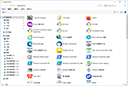

# AppsFolderDialog

<p align="center">
 
</p>
</p>
<p align="center">
<a href="https://github.com/TianXiaTech/AppsFolderDialog/stargazers" target="_blank">
 
</a>
<a href="https://github.com/TianXiaTech/AppsFolderDialog/releases" target="_blank">
 
</a>
<a href="https://github.com/TianXiaTech/AppsFolderDialog/network/members" target="_blank">
 
</a>
<a href="https://github.com/TianXiaTech/AppsFolderDialog/issues" target="_blank">
 
</a>
</p>

Provide a dialog box to select installed app from local machine.


the selected item is [Application User Model ID](https://learn.microsoft.com/en-us/windows/win32/shell/appids) ,You can run it in the following way

* **Run dialog**
```
shell:appsfolder\xxx
```

* **C#**
```C#
System.Diagnostic.Process.Start("explorer.exe","shell:appsfolder\xxx");
```

# Example
```C#
System.Diagnostic.Process.Start("explorer.exe","shell:appsfolder\Microsoft.Windows.MediaPlayer32");  //open Windows Media Player
```

# Preview

https://github.com/TianXiaTech/AppsFolderDialog/assets/22126367/76a04910-6261-4811-9233-814f802eb7ed


# Usage
```Powershell
PM>NuGet\Install-Package AppsFolderDialog -Version 0.0.1
```
```C#
AppsFolderDialog.AppsFolderDialog appsFolderDialog = new AppsFolderDialog.AppsFolderDialog();
var result = await appsFolderDialog.ShowDialog();

if(result)
{
    //this.listbox.ItemsSource = appsFolderDialog.SelectedPath.ToList();
    foreach (var item in appsFolderDialog.SelectedPath)
    {
        switch(item.PathType)
        {
            case AppsFolderDialog.PathType.Absolute:
                //Absolute
                System.Diagnostics.Process.Start(item.Path);
                break;
            case AppsFolderDialog.PathType.AUMID:
                //AUMID
                System.Diagnostics.Process.Start("explorer.exe", item.Path);
                break;
            case AppsFolderDialog.PathType.Folder:
                //Folder
                break;
            default:
                break;
        }
    }
}
```

### LICENSE
[Apache License](LICENSE)

